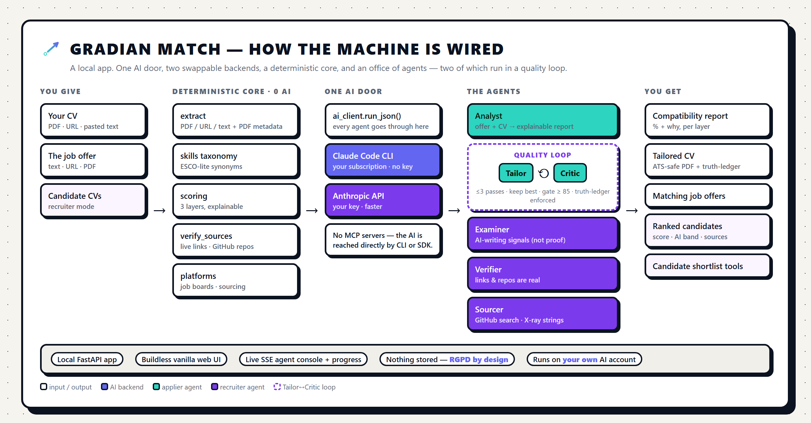

# Gradian Match

> 🚧 **Work in progress.** This is an active build by [Gradian](https://gradiangrowth.com) — usable today, still evolving. Expect rough edges.

A **local, agentic** CV ↔ job-offer analyzer. It reads a CV and a job offer and tells you — *explainably* — how well they fit, then rewrites the CV to fit better. It works from **both sides of the table**: the **Applier** (job-seeker) and the **Recruiter** (hiring).

It runs entirely on **your machine** and on **your own AI account**. Nothing is stored; nothing leaves your computer except the calls you make. It is not a website you log into — it's an app you run.

*(Full walkthrough: **[docs/how-it-works.pdf](docs/how-it-works.pdf)**.)*

---

## What it does

### Applier — for job-seekers
- **Explainable compatibility score** — ATS keyword coverage + recruiter gating (languages, years) + the AI's semantic read, each shown separately so you see *why*, not just a black-box %.
- **Job Finder** across free job boards (Arbeitnow, Remotive; add Adzuna/Jooble keys for more), or paste a specific offer link.
- **Regenerate your CV** for a specific offer with a 1–100 aggressiveness slider, refined by an internal **Tailor ↔ Critic loop** (keeps rewriting until it passes the quality gate), plus a transparency **truth-ledger** of anything newly claimed — and a one-click **ATS-safe PDF** (previewed inline).

### Recruiter — for hiring
- **Screen & rank** a batch of candidate CVs against one role.
- **AI-writing signals** — heuristics + a reading model flag likely AI-written CVs as **signals, never proof**.
- **Source verification** — checks that a candidate's links and GitHub repositories are real.
- **Legal sourcing** — GitHub user search + a Google/LinkedIn **X-ray** string you run in your own browser (no scraping).

### The live "agentic OS" view
Every run streams a **live agent console** — you watch the Extractor, Analyst, Tailor, Critic (and, for recruiters, Examiner, Verifier, Sourcer) light up as they work, with a progress bar. No more staring at a frozen button.

---

## Requirements

1. **An AI backend — pick one:**
   - **Claude Code** (recommended, no key): install and sign in — https://claude.com/claude-code (check with `claude --version`).
   - **Anthropic API key** (faster per call): put `ANTHROPIC_API_KEY=…` in `.env` (get one at https://console.anthropic.com/).
2. **Python 3.11+**
3. **Google Chrome or Microsoft Edge** — used to render the CV to PDF.

## Run (Windows)

1. Download or clone this repo.
2. Double-click **`start.bat`** — the first run creates a virtual environment and installs dependencies automatically.
3. Your browser opens at **http://127.0.0.1:8765**.

Paste (or upload a PDF of) your CV and a job offer, then **Analyze**. Move the slider and **Regenerate** to get a tailored CV you can download as a PDF. Switch to the **Recruiter** tab to screen candidates.

> On other platforms, run it by hand: `python -m venv .venv` → activate → `pip install -r requirements.txt` → `PYTHONPATH=src python -m uvicorn gradianmatch.server:app --port 8765`.

## Configuration (`.env`, all optional)

Copy `.env.example` to `.env`:

| Key | For |
|---|---|
| `ANTHROPIC_API_KEY` | Use the API backend instead of Claude Code. |
| `GM_BACKEND` | Force `auto` (default) / `cli` / `api`. |
| `GM_MODEL` | Override the model (default `claude-opus-4-8` on the API backend; e.g. `claude-sonnet-5` for faster/cheaper). |
| `ADZUNA_APP_ID` / `ADZUNA_APP_KEY` / `JOOBLE_KEY` | Wider Job Finder coverage. |
| `GITHUB_TOKEN` | Higher GitHub rate limits for source verification. |

The analyze / regenerate core needs **none** of these — only an AI backend.

## Privacy & safety

Everything runs locally and **in-memory per session** — nothing is persisted, temporary files are deleted. The server binds to **127.0.0.1** (your machine only) and rejects cross-origin requests; **do not** expose it to a public network. The only text that leaves your machine goes to *your own* AI account and any job boards you enable.

The tailoring slider can *emphasize* your real experience aggressively, but the truth-ledger flags anything it adds beyond your source CV — **you** are responsible for the accuracy of what you send to employers. In recruiter mode you process third parties' data: the legal basis is yours, and the tool holds nothing. The AI-writing flags are **signals, not proof** — never auto-reject anyone on them.

## For developers

- Deterministic core (extraction, skill taxonomy, scoring, source verification, job-board adapters) with **no AI**, plus an agentic layer (Analyst / Tailor / Critic / Examiner / Sourcer as prompt modules) orchestrated by a FastAPI backend that serves a **buildless** vanilla-JS UI.
- All AI goes through one door — `ai_client` → Claude Code CLI **or** the Anthropic SDK.
- Run the tests: `pip install -r requirements-dev.txt` then `python -m pytest`.

## The Gradian ecosystem

This tool applies the same production pattern as the rest of Gradian — narrow specialist agents,
a producer ↔ critic loop with a numeric quality gate, and a human making the final call:

| Repo | What it shows |
|---|---|
| **[gradian-sistema](https://github.com/Arekusumt/gradian-sistema)** | The factory: an interactive map of the 28-agent office, with measured usage numbers. *The system.* |
| **[gradian-caso-waterfront](https://github.com/Arekusumt/gradian-caso-waterfront)** | A finished piece from that factory: a real pub's website, live in production, explained from the paper menus to deploy. *The result.* |
| **gradian-match** (you are here) | The same pattern transferred to another domain: CV ↔ job-offer analysis. *The pattern, transferred.* |

## License

**Source-available, not open source.** © Gradian. All rights reserved — see [`LICENSE`](LICENSE). You may read and run it locally for personal, non-commercial use; redistribution, commercial use, and derivative distribution require written permission. Questions: **alex@gradiangrowth.com**.
